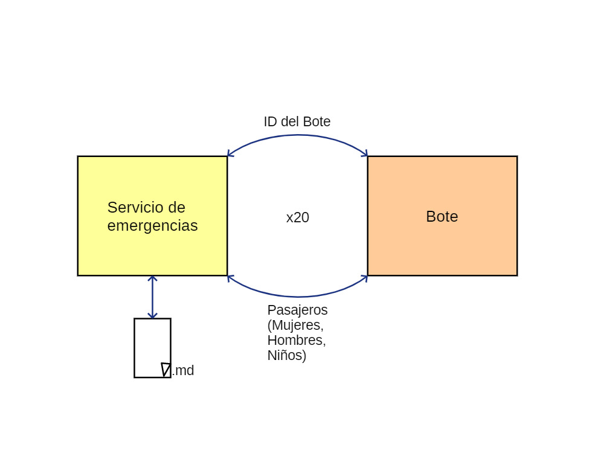
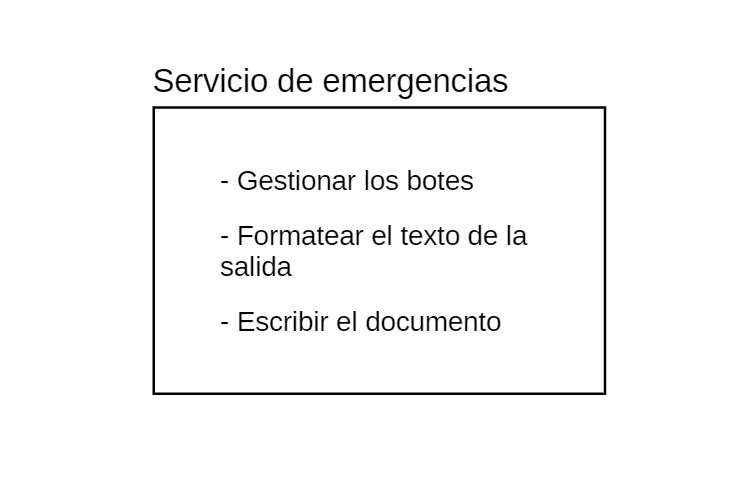
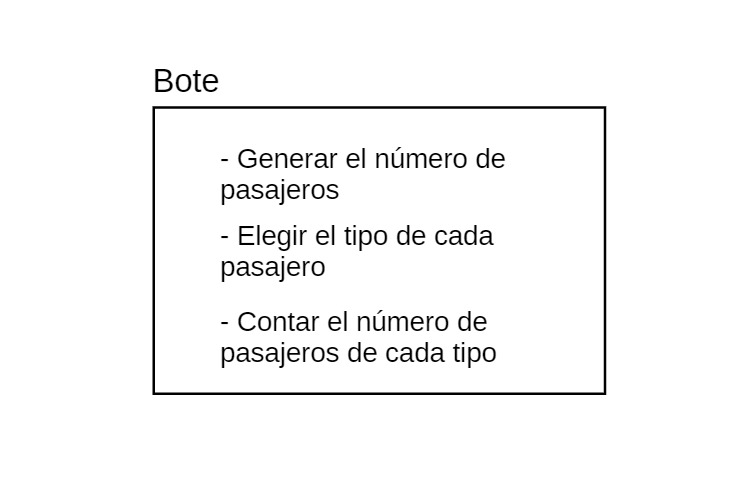

# Titanic

### Creado por: 

- Alberto Ubeda-Portugues 
- Carlos Hermoso Delgado

## Indice

1. Analisis del Problema
1. Diseño de la solución
    - Arquitectura
    - Componentes
        - Servicio de emergencias
        - Bote
    - Protocolo de comunicacion
    - Plan de pruebas
1. Manual de usuario
1. Elementos destacables del desarrollo
1. Problemas encontrados
1. Conclusiones individuales
1. Anexos

## 1. Analisis del problema

Se nos plantea simular los botes salvavidas del Titanic. Por cada bote se selecciona un número aleatorio de pasajeros del 0 al 100 y se les clasifica en mujeres, hombres o niños. El servicio de emergencia es el encargado de embarcar los botes y asignarles un número que va del B00 al B19. Los botes recuentan sus pasajeros y pasan el recuento al servicio de emergencia. Este lo recoge y, tras embarcar todos los botes, escribe un documento con todo el recuento completo.

## 2. Diseño de la solución

### Arquitectura

El proyecto contará con dos partes diferenciadas: el servicio de emergencia y el bote. El primero se encargará de ejecutar el bote, dándole un ID, y este generará y enviará los datos de los pasajeros. Posteriormente, el servicio de emergencia generará un documento en Markdown.

### Componentes

### - Servicio de emergencias

El servicio de emergencias tendrá un programa principal (*Main*) llamado `ServicioEmergencia` que será el que ejecutaremos. 

Además, tiene varias funcionalidades: gestionar los botes, darle el formato deseado al texto de salida y escribir ese texto en un documento. 

> **Gestion de los botes**(`gestion_botes`):

La gestión de los botes se encargará de ejecutar el comando de los botes y de recibir la salida en forma de *String*.

> **Gestion del formato**(`gestion_formato`):

La gestión del formato contará con una enumeración con los diferentes formatos que soporte el programa, MD y HTML; contará con una factoría de formateadores que, dependiendo del formato, creará un formateador u otro. 

Los formatadores serán los encargados de darle formato al texto de salida. Estos contarán con maneras de incluir los elementos necesarios para el documento final: título, fecha, cuerpo del documento (información de cada bote) y la información total recogida.

> **Gestion del documento** (`gestion_documento`):

Finalmente, la gestión del documento será la encargada de, mediante la ruta y el texto final con su formato correspondiente, crear el archivo con la información.

### - Bote

El bote también contará con su propio Main llamado `Bote` que será el que ejecutará el servicio de emergencias, lanzándolo como un proceso.

Este debe generar un número de pasajeros de forma aleatoria, asignarles un tipo entre mujeres, hombres y niños y contar cuántos pasajeros de cada tipo hay.

### Protocolo de comunicación

## 7. Anexos

### - Repositorio de Github: 
https://github.com/TingusC/Titanic